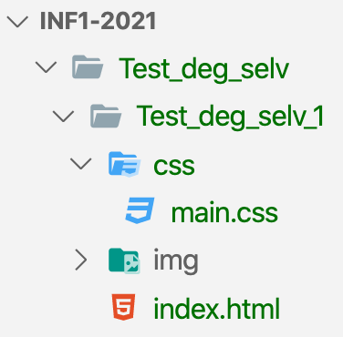

# Test deg selv 1

## 1.1 Filstruktur

---

Lag følgende filstruktur:

## 2.1

---

I index.html:

- Endre "title" til "Test deg selv 1".
- Lag en overskrift (<a href="https://www.w3schools.com/tags/tag_hn.asp">h1</a>) "Test deg selv 1" i <a href="https://www.w3schools.com/tags/tag_body.asp">body</a>.
- Lag en mindre overskrift (<a href="https://www.w3schools.com/tags/tag_hn.asp">h2</a>) "2.1".
- Lag en linje under med <a href="https://www.w3schools.com/tags/tag_hr.asp">hr</a>.
- Ta skjermbilde av filstrukturen til "Test_deg_selv"-mappen og legg det i img-mappen.
- bruk <a href="https://www.w3schools.com/tags/tag_img.asp">img-tagen</a> til å legge in skjermbildet på nettsiden.

## 2.2

---

I index.html:

- Lag en overskrift (<a href="https://www.w3schools.com/tags/tag_hn.asp">h2</a>) "2.1".
- Lag en linje under med <a href="https://www.w3schools.com/tags/tag_hr.asp">hr</a>.
- Lag en liste med <a href="https://www.w3schools.com/tags/tag_ul.asp">ul</a> der du lister opp komponentene vi har snakket om i timen.

## 2.3

---

I index.html:

- Lag en overskrift (<a href="https://www.w3schools.com/tags/tag_hn.asp">h2</a>) "2.1".
- Lag en linje under med <a href="https://www.w3schools.com/tags/tag_hr.asp">hr</a>.
- Lag en overskrift (<a href="https://www.w3schools.com/tags/tag_hn.asp">h3</a>) med teksten HTML.
- Lag to paragrafer (<a href="https://www.w3schools.com/tags/tag_p.asp">p</a>) med litt informasjon om <a html="https://en.wikipedia.org/wiki/HTML">HTML</a>.

## 3.1

---

I index.html:

- Legg til en <a href="https://www.w3schools.com/tags/tag_link.asp">link-tag</a> i <a href="https://www.w3schools.com/tags/tag_head.asp">head</a> for å koble til main.css i css-mappen din.

I main.css:

- Bytt farger
  - body-bagrunn: #E08077 <a href="https://www.w3schools.com/cssref/pr_background-color.asp">tips</a>
  - h1: #1E82A8 <a href="https://www.w3schools.com/cssref/pr_text_color.asp">tips</a>
  - h2: #A81E3B
  - p: #506B75

## 3.2

---

I index.html:

- Lag en overskrift (<a href="https://www.w3schools.com/tags/tag_hn.asp">h2</a>) "3.2".
- Lag en linje under med <a href="https://www.w3schools.com/tags/tag_hr.asp">hr</a>.
- Legg til en <a href="https://www.w3schools.com/tags/tag_div.asp">div-tag</a> med class="boks".

I main.css:

- Referer til til div-tagen og gjør følgende:
  - Bredde: 300px
  - Høyde: 100px
  - Bakgrunnsfarge: #A81E3B
  - Ramme/marg: 10px, solid og #506B75
  - Rund av kantene på boksen
  - Bruk <a href="https://www.w3schools.com/cssref/pr_margin.asp">margin</a> og test med 100px og auto. Hva skjer. Forklar i en p-tak under tiv-tagen i index.html
