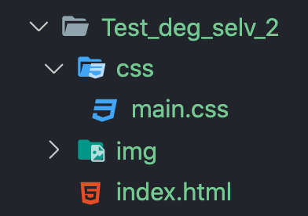
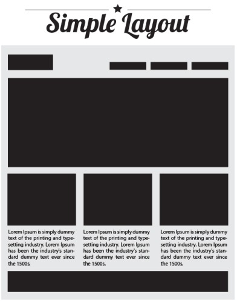

# Test deg selv 1

## 1.1 Filstruktur

---

Lag følgende filstruktur:

## 2.1

---

I index.html:

Bruk https://bit.ly/2FrvFZZ som utgangspunkt på HTML-filen din.

## 2.2

---

Bruk css til å få nettsiden til å se lik ut som bildet under.

## 3.1

Fullfør nettstedet med to sider til. Velg egne layout, men prøv å gjør alle sidene forskjellige. Dvs bruk litt ulig grid-oppsett og boksutseende.

Inspirasjon:

- <a href="https://braasport.no/sport/alpin-topptur/randonneeski">Braasport</a>
- <a href="https://www.fjellsport.no/produkter/turutstyr/ski-utstyr.html">Fjellsport</a>
- <a href="https://www.vpg.no/produkter/klatring/klatresko">VPG</a>
- <a href="https://www.sportsnett.no/ski">Sportsnett</a>
